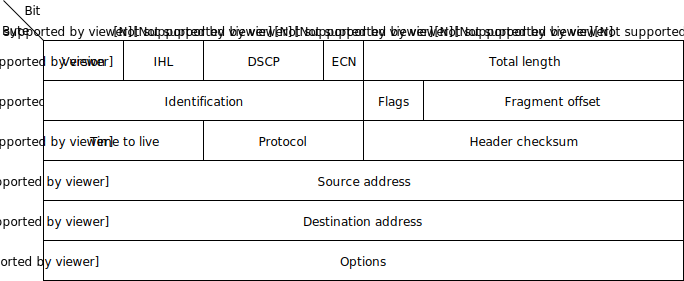

# What is IoT

## What is IoT

* Not "a computer connected to the internet"
    * Then it is really just another computer connected to the internet

* Must be something else
    * It is simply devices that are resource constrained
        * Usually in more than one way

* Autonomous operation, the connection might not be permanent

## IoT is just a concept

* *The Internet of Things (IoT) is the network of physical devices,
  vehicles, home appliances and other items embedded with
  electronics, software, sensors, actuators, and connectivity which
  enables these objects to connect and exchange data.*^[
  Wikipedia "Internet of Things"]

## What is an IoT Device?

::: notes

As for their definition.

What differentiates a computer from an IoT device?

:::

## What is an IoT Device?

* Constrained in (one or more of):
    * Memory
    * CPU
    * Network bandwidth and/or latency
    * Storage
* Connected
    * Bluetooth
    * Wi-Fi
    * NB-IoT
    * LTE Cat-M
<!-- -->
    * IR
    * UART
    * CAN

::: notes

:::

## Typical IoT chips - Bluetooth 4/5

!comment
~~~
~~~
Chip     CPU      Freq RAM      Flash  Price
-------- -------- ---- -------- ------ ------
nRF52810 Cortex-M4 64 MHz    24k   192k  $1.88
High performance, entry-level Bluetooth 4/ANT/2.4GHz SoC

nRF52832 Cortex-M4F          32k   256k  $2.54
                             64k   512k  $2.59
High performance Bluetooth 4/ANT/2.4GHz SoC

nRF52840 Cortex-M4F         256k  1024k  $3.85
Advanced multi-protocol System-on-Chip Supporting: Bluetooth 5, ANT/ANT+, 802.15.4 and 2.4GHz proprietary

::: notes

All quantities are 1000 pieces

nRF51: https://www.digikey.no/products/en/rf-if-and-rfid/rf-transceiver-ics/879?k=nrf51822

nRF52832: these have different packagings, not only difference price

https://www.digikey.no/products/en/rf-if-and-rfid/rf-transceiver-ics/879?FV=1c0001%2Cffe0036f&quantity=3000&ColumnSort=1000011&page=1&k=nrf52832&pageSize=500&pkeyword=nrf52810

:::

## Typical IoT chips - Wi-Fi

Chip    CPU            Freq     ROM   RAM    Price
-----   -------        -------  ----- ------ ------
ESP8266 Tensilica L106 160 MHz    N/A ~50 kB   < $1

ESP32 - dual cpu, Wi-Fi, Bluetooth 4
ESP32-D0WDQ6 2x Xtensa @ 160MHz  $ 4.53 @ 10

::: notes

The ESP8266's RAM depends on which firmware stack is used. Physical is probably 128k or most likely 64k.

:::

## ESP8266 details - Power usage

+--------------------------+----------------+
| State                    | Current usage  |
+==========================+===============:+
| Off                      | 0.5 µA         |
+--------------------------+----------------+
| Deep sleep with RTC      | 20 µA          |
+--------------------------+----------------+
| Light sleep (with Wi-Fi) | 1 mA           |
+--------------------------+----------------+
| Sleep with peripherials  | 15 mA          |
+--------------------------+----------------+
| TX                       | 170 mA         |
+--------------------------+----------------+

::: notes

Datasheet page 18

:::

## ESP8266 details - Arduino

https://github.com/esp8266/Arduino

# Going back to basics

## What is the internet again?

## OSI model

1. Physical Layer
1. Data Link Layer
1. Network Layer
1. Transport Layer
1. Session Layer
1. Presentation Layer
1. Application Layer

* [Wikipedia: OSI model](https://en.wikipedia.org/wiki/OSI_model)
* [Wikipedia: OSI model#Examples](https://en.wikipedia.org/wiki/OSI_model#Examples)

::: notes

Does not match the TCP/IP stack very closely.

:::

## Layer 1: Physical Layer

* 10BASE5, 10BASE2
* 10BASE-T / 100BASE-TX / 1000BASE-TX
* 802.11a/b/g/n PHY
* RS-232

::: notes

Ethernet: Hubs and switches (that act on this level) is not on it's own
layer. It is more of a implementation detail in the architecture diagram.

RS-232 signaling is used in *all* MCUs, many have several ports
available. It is extremely flexible, both used for implementing
applications and debugging. Frequently an easy way to hack embedded
devices. "USB dongles", "USB TTL" all use RS-232 signaling.

Note that this only applies to its logical signals, not voltage
levels. The signaling does not specify any max data rate, very high rates
(>= 1Mbps) is often supported.

:::

## Layer 2: Data Link Layer

* Ethernet
* WiFi
* Bluetooth
* Token Ring

## Layer 3: Network Layer

* IP
* ICMP
* IPX

## Layer 4: Transport Layer

* TCP
* UDP

## Layer 5: Session Layer

* "sockets"
* NetBIOS

## Layer 6: Presentation Layer

* SSL

::: notes

This layer is not really much used in the IP stack

:::

## Layer 7: Application Layer

* HTTP
* DNS
* MQTT
* CoAP
* (everything else..)

## Details: IP

!ifdef(REVEAL)
~~~~~~~~~~~~~~~~~~~~~~~~~~~~~~

~~~~~~~~~~~~~~~~~~~~~~~~~~~~~~
!ifdef(BEAMER)
~~~~~~~~~~~~~~~~~~~~~~~~~~~~~~
!ifndef(QUICK)()
~~~~~~~~~~~~~~~~~~~~~~~~~~~~~~

::: notes

Note that the "total length" field is 16 bits, 2 bytes, it's maximum value is 64k, 65536.

:::

## Details: IP

!ifndef(QUICK)(!include(images/IP-Header_eng.tex))

!comment
~~~~~~~~~~~~~~~~~~~~~~~~~~~~~~

~~~~~~~~~~~~~~~~~~~~~~~~~~~~~~

# Lecture: ESP8266

!comment(aka NodeMCU aka ESP-12)

## ESP8266 software layers

!ifndef(QUICK)(!include(images/esp+arduino-sdks.pgf))

# Lecture: MQTT

## MQTT

* *Message Queuing Telemetry Transport*
* [Wikipedia: MQTT](https://en.wikipedia.org/wiki/MQTT)

::: notes

MQTT is *the* standard for IoT applications (and lots of other useful stuff to). Using HTTP is just silly.

Supports SSL, and requires TCP.

Has UDP-like semantics with "fire and forget" but on a higher level (the message always have to be delivered and ACKed by the broker, not it's final recipient.

Version 3.1.1 er den som gjelder, V 3.1 er rar, de andre finnes ikke (før standardisering).

:::

## MQTT - The protocol

Agents have one of two roles: 

* *Client*
    * Publishes *messages*
    * Subscribes / unsubscribes to *topics*

* *Broker* (aka Server)
    * Handles network connections
    * Keeps subscriptions
    * Manages client
        * Disconnects
        * *(last) will*
    * Persistence of retained messages

::: notes

network connections: this includes removing closed sockets, client's that doesn't respons to timeouts and duplicate clients.

http://docs.oasis-open.org/mqtt/mqtt/v3.1.1/mqtt-v3.1.1.html

Subscriptions are not permanent. The connection is (unlike HTTP)
stateful.

Some messages may be persistent, but only one per topic. You will
often end up with a "proper" mq on the backend if queuing is needed.

:::

## MQTT - The protocol - MQTT Topic

* Topic name: `foo/bar/baz`
* Topic filter
    * `foo/bar/?`
    * `foo/#`

## MQTT - The protocol - MQTT Topic

The temperature sensor:

* Publishes on:
    * `myapp/$device-id/temperature`
    * `myapp/$device-id/humidity`
    * `myapp/$device-id/altert`
* Subscribes to:
    * `myapp/$device-id/command`

The central application:

* Subscribes to:
    * `myapp/#/temperature`
    * `myapp/#/humidity`
* Publishes on:
    * `myapp/$device-id/command`

::: notes

Typical first round of implementation.

Commands can be:
* load new firmware (maybe an URL and firmware signature).
* Set new calibration values
* Change reading interval, altert levels (autonomous operation)

:::

## MQTT - The protocol - MQTT Packet

* Size oriented
* Flags indicate type of remaining bytes
  * Packet type
  * Topic name
  * Payload

::: notes

Only packet type + flags (1 byte) is required, everything else is optional.

The size field is variable length encoded, 0-127 bytes is 1 byte, 128-16383 use 2 bytes etc, up to 4 bytes for 256MB payload.

:::

## MQTT - The protocol - MQTT Topic - more

Enten må den holdes rett etter "## MQTT - The protocol - MQTT Topic" ellers kanskje flyttes etter "patterns".

The central application is split:

* An aggregating agent:
    * `myapp/#/temperature`
    * `myapp/#/humidity`
* Emailing agent
    * `myapp/$device-id/altert`

* Publishes on:
    * `myapp/$device-id/command`

::: notes

:::

## MQTT - The protocol - Retained message

Message is kept by the server even after disconnect

* `CONNECT`
* `PUBLISH`
    * `RETAIN`
    * `$app/$device/temperature`
    * `22.3`
* `DISCONNECT`

Later on:

* `SUBSCRIBE`
    * `$app/#/temperature`
* `PUBLISH`
    * `$app/$device/temperature`
    * `22.3`

::: notes

The last PUBLISH is an incoming message

:::

## MQTT - The protocol - Will message

Message sent when you disconnect

Client #1:

1. `CONNECT`
    * `WILL TOPIC: $app/$device/online`
    * `WILL PAYLOAD: 0`
1. `PUBLISH`
    * `$app/$device/online`
    * `1`
1. `DISCONNECT`

Broker

1. *To all subscribers* `PUBLISH`
    * `$app/$device/online`
    * `0`

## MQTT - Patterns

Må utvides

Explain:

* Push vs pull, central applications can push to clients
* mostly mqtt, some http
* Client id - sparker ut gamle koblinger
* Keep alive / ping meldinger
* Alternative transporter - websockets(!)

## MQTT - Implementations

* Mosquitto
* Eclipse Paho
* RabbitMQ
* ActiveMQ

::: notes

RabbitMQ has a separate connector that must be installed
Not sure about ActiveMQ but it is at least a part of the project so it is releases at the same time.

:::

## MQTT Cloud Connectors

* Cloud
    * Amazon IoT
    * Google Cloud IoT
    * Microsoft Azure IoT
    * CloudMQTT (at Heroku)

* DIY
    * ThingMQ
    * HiveMQ

::: notes

In between are:

* self hosted
* Generic bridges

:::

# Assignments

## Assignment 1: Blink a led

## Assignment 2: Connect to Wi-Fi

## Assignment 3: Connect to MQTT broker

## Assignment 4: Network play time

* Measure round trip time/latency. Measure UDP, TCP. Measure when the
  packet size is greater than the MTU

* Notice variations in RTT
